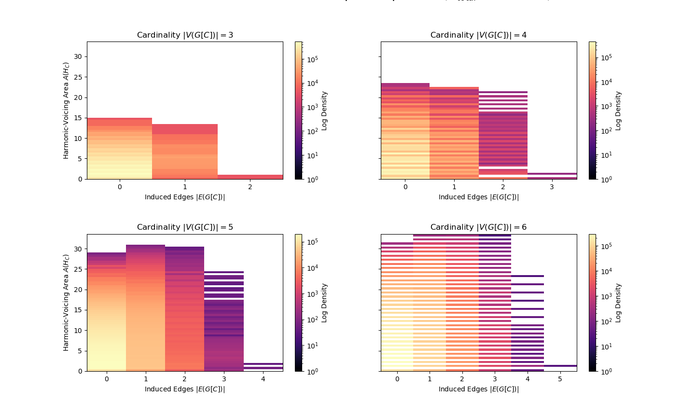

# GuitarManifoldsMonteCarlo
This repository provides the computational foundation for a 31-page research manuscript titled "METRIC INDEPENDENCE IN DISCRETE CYLINDRICAL MANIFOLDS," where we explore the geometric properties of the pitch class space in the guitar. The core of the framework is an isometric lift—conceptually analogous to a Nash Embedding—which "unrolls" the discrete cylindrical manifold $G$ of the fretboard into a Euclidean universal cover $\mathbb{R}^2$.

By mapping chordal voicings into this Euclidean plane, we derive a unique geometric signature (Harmonic Area and Shape Vector) for guitar chord vocings that resolves the "Spectral Blindness" inherent in unweighted graph models. The provided Monte Carlo simulation of $2.4 \times 10^7$ total iterations validates the Metric Independence Thesis (independence of local connectivity and global compactness), empirically identifying the chiral fault line between the G-B strings on the guitar, and parity-locked area quantization across the manifold.

# Problem Statement
Traditional unweighted graphs cannot distinguish between functionally different chord voicings because the collapse into the same "linear forest."

# Our Solution
This repository utilizes a geometric lifting logic that maps guitar chords to universal Euclidean cover $\mathbb{R}^2$ to calculate their Harmonic-Voicing Area $A(H_C)$.

# Usage and Reproducibility
1. Clone the repository and navigate to the root directory.
2. Install dependencies: `pip install -r requirements.txt`.
3. Run the script: `mcm.py`.

# Core Features
1. Coordinate Lifting: Implementation of the circular difference logic to unroll the cylindrical pitch class space of the guitar into linear space.
2. Global Fretboard Census: A Monte Carlo simulation script that executes $2.4 \times 10^7$ iterations to map the state space of 3, 4, 5, and 6-string chords.
3. Metric Independence: We plot the results of this Monte Carlo simulation to visualize the non-bijective relationship between local connectivity (edges) and global compactness (area).

# Key Findings
1. Area Quantization: The simulation empirically identifies the "parity-locked" no-go zones where half-integer areas are mathematically impossible for 6-string chords.
2. The Ground State: Verification that at maximum connectivity $|E|=5$, the manifold forces a geometric area of $1$ regardless of vertical translation.

# Cite This Repository
Citation: Kim, J.T., "METRIC INDEPENDENCE IN DISCRETE CYLINDRICAL MANIFOLDS," Journal of Mathematics and Music (Submitted for Peer Review 2026).
